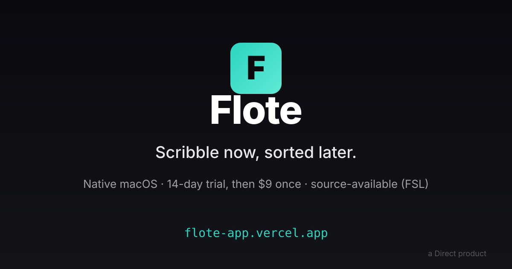

<p align="center">
  <a href="https://flote-app.vercel.app">
    
  </a>
</p>

# Flote

[](./LICENSE.md)
[](https://flote-app.vercel.app)
[](https://flote-app.vercel.app)
[](https://direct-homepage.vercel.app)

> **Scribbles, auto-organized.**
>
> Press Option+Space and a sticky note floats up. Write down whatever you were thinking, as-is. Press the Organize button once. AI turns it into a title, key points, and a checklist. That's the whole thing.

- Public repository: https://github.com/tomarai85/flote
- Official site: https://flote-app.vercel.app (= full install steps + roadmap)
- Parent brand: [a Direct product](https://direct-homepage.vercel.app)
- License: [FSL-1.1-ALv2](./LICENSE.md) (= converts to Apache 2.0 after 2 years)
- Security: [report vulnerabilities via SECURITY.md](./SECURITY.md)
- Status: **14-day free trial → $9 one-time purchase** (no subscription, no card up front) / macOS 14 (Sonoma) or later / Apple Silicon

[日本語 README](./README.md)

---

## Why Flote

Most note apps are built for people who are good at organizing.
Notion, Obsidian, Apple Notes — all of them assume you can design tags, draw hierarchies, and link things together.

Not everyone is that person.
**Some of us just want to get a thought down somewhere before it evaporates. Organizing can wait (= really, we don't want to think about it at all).**
Until now, there hasn't been a notes app built for that person.

Flote exists to fill that gap.

- Launches in 2 seconds (resident app); Option+Space floats a 160px sticky note onto your desktop
- The Organize button lets AI structure your scribble (title / key points / action list)
- Notes are stored only on your Mac, encrypted at rest with AES-256-GCM, never sent to the cloud (= on-device AI is the default; the only network traffic happens if you opt into Claude or Gemini). No telemetry, no analytics SDK
- Native SwiftUI + AppKit. Not Electron

An organized notebook, for people who can't organize.

---

## Install / Quick Start

### macOS

The fastest path is the official site:

→ https://flote-website.vercel.app

Direct download (= signed + notarized dmg, GitHub Releases):

→ https://github.com/tomarai85/flote/releases/latest/download/Flote.dmg

1. Open the dmg
2. Drag Flote into Applications
3. Launch it (= Apple Developer ID signed + notarized, so it opens with no warning)

After first launch:

1. A **Flote** icon appears in the menu bar
2. Press `Option + Space` to float a sticky note
3. Write something, then hit Organize for AI structuring

AI Organize needs no separate install: on Apple Intelligence-capable Macs (= macOS 26+), on-device Apple Foundation Models runs by default. On Macs without it, a bundled local model (Qwen 2.5, 4-bit MLX, Apple Silicon only, ~880MB) downloads once on first use and runs offline after that. For longer or more involved notes, you can optionally add a Claude or Gemini API key in Settings to route through the cloud.

Updates: the built-in [Sparkle](https://sparkle-project.org) framework checks automatically (= or check manually via menu bar Flote → Check for Updates).

### Build from source

```
cd apps/macos
open Flote.xcodeproj   # Xcode 16+ / Swift 5.10+
```

Press `Cmd + R` to run. Dev builds that use an API key go through the Settings UI into Keychain storage (= the old `DevSecrets.swift` fallback is gitignored and not part of the public repo).

---

## Features

| Feature | Description |
|---|---|
| **Resident + floating sticky note** | Menu-bar resident; `Option+Space` floats a 160px sticky note over any app |
| **AI Organize** | One button turns a scribble into a title / key points / checkbox action list. On-device AI (Apple Foundation Models / bundled local model) by default; optionally switch to Claude / Gemini API |
| **Learning classifier** | The more you use it, the more Flote learns your classification patterns and auto-sorts notes into Groups |
| **Inbox batch classify** | Sort a whole backlog of unclassified notes with one button, emptying the Inbox |
| **Undo** | Don't like the Organize result? `Cmd+Z` reverts to the scribble |
| **Custom shortcuts** | Rebind the keys for New Note / Show Groups / Archive |
| **Data stays on your Mac** | Notes are stored locally, encrypted with AES-256-GCM. No telemetry. Network traffic only happens if you use cloud AI (Claude/Gemini) (= fully offline when using on-device AI) |

See the Before/After section on the site for detailed usage: https://flote-website.vercel.app

---

## License -- FSL-1.1-ALv2

Flote is released as **source-available**:

- **Allowed right now** (= Permitted Purpose):
  - Personal use (= running it yourself as an end user on your own Mac)
  - Internal use (= distributing it to employees / contractors within your company or lab)
  - Non-commercial education / research
  - Reading the source, modifying it, maintaining your own fork
- **Not allowed** (= Competing Use):
  - Hosting Flote as a SaaS / commercial product for third parties
  - Building a commercial product that duplicates Flote's functionality
- **After 2 years** (= from 2028-05-27): automatically converts to **Apache License 2.0** (= the [Functional Source License](https://fsl.software/)'s future-grant clause)

Full details in [LICENSE.md](./LICENSE.md). "FSL-1.1-ALv2" is synonymous with "FSL-1.1-Apache-2.0" (= ALv2 = Apache License Version 2.0).

### Why FSL

- **MIT / Apache from day one**: can't stop someone forking it and selling the same thing under a different brand
- **AGPL**: reads as "hard to use" to the community (= forces full source disclosure on every derivative product)
- **Fully closed**: gives up the transparency / trust that matters for solo indie development
- **FSL** sits between those three. A 2-year protection window followed by automatic OSS conversion gets "indie development speed + protection from copycats + long-term community payback" at the same time

---

## Roadmap

### Phase 1 (= 2026-05, this repository's public release -- reached v1.0.5 by 2026-07)
- Open-sourced (source-available) on GitHub under FSL-1.1-ALv2
- Added GitHub link + free-beta narrative + pre-launch email waitlist to the site
- Free beta continues (= ¥0 for now, no end date)
- Apple Developer Program enrollment + proper signing + notarization complete (= from v1.0), notarized dmg distributed via GitHub Releases + Sparkle auto-update
- AI Organize rebuilt around on-device Apple Foundation Models (macOS 26+) + a bundled local model (Qwen 2.5 MLX), dropping the Ollama dependency. Added Gemini as a second BYO-key cloud option alongside Claude

### Phase 2 (= timing TBD, evaluating freemium-light)
- After awareness grows (= GitHub stars / DAU / AI search hits, whichever comes first), consider a ~¥300 paid tier for new users
- Grandfathering existing free users is a separate decision, deferred to Phase 2
- One benchmark for pricing timing: "once Flote is findable via AI search"
- Waitlist emails actually going out (= evaluating Loops / ConvertKit / Buttondown)
- Flutter-based Windows build

### Phase 3+
- Settings sync (= across multiple Macs / Mac+Windows)
- iOS exploration (= after Helix iOS's delivery path is settled)

### A note on discoverability
- The site currently opts out of search indexing via `robots.txt` + `X-Robots-Tag: noindex` (= `website/vercel.json`)
- This is a deliberate Phase 1 stance: not ready for the site to be found via AI search / Google yet — word of mouth inside the Mac dev community first
- Opening up discoverability is a separate Phase 2 decision (= likely to land around the same time as the ¥300 pricing decision above)

---

## Contributing

During Phase 1, this repo is **issues only**:

- Bug reports / feature requests / usability feedback → GitHub Issues are very welcome
- Pull requests → **closed for now**. PR review reopens once the license auto-converts to Apache 2.0 in 2 years

Why:
- Phase 1 is for locking in brand voice / design intent
- One solo developer doesn't have the bandwidth to review PRs
- Once Apache 2.0 lands, forking + community-driven development becomes possible

For urgent security reports, contact directly rather than filing an Issue.

---

## Acknowledgements

- **Flote is a Direct product.** Direct is a portfolio of native Mac tools built and run solo by Tomonori Arai (荒井 知憲). Sibling product: [Helix](https://direct-homepage.vercel.app) (= privacy-first Chromium-fork browser)
- Scribble-structuring AI runs on-device by default (= Apple's Foundation Models framework, or a bundled local model, Qwen 2.5 / MLX, on Macs without it). Optionally add a [Claude](https://www.anthropic.com/claude) (Anthropic) or Gemini (Google) API key for cloud processing
- Updates are delivered via the [Sparkle](https://sparkle-project.org) framework

---

## Links

- Site: https://flote-website.vercel.app
- Direct (= parent): https://direct-homepage.vercel.app
- Author: Tomonori Arai (= 荒井 知憲) -- @TomArai85 on X (= personal brand)
- License: [FSL-1.1-ALv2](./LICENSE.md)
- This README is a derivative. Primary source: [日本語 README](./README.md)
